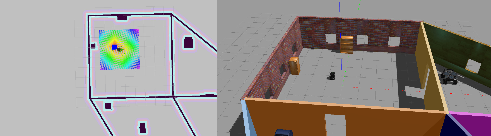

# Home Service Robot Project
This is the final project of the Robotics Software Engineer Nanodegree Program. 
In this project a home service robot (Turtlebot) is deployed to navigate to an object to pick up and drop off an object.

## Packages
### Official ROS Packages used in this project
* [Turtlebot](https://github.com/turtlebot/turtlebot)
* [Turtlebot interactions](https://github.com/turtlebot/turtlebot_interactions)
* [Turtlebot simulator](https://github.com/turtlebot/turtlebot_simulator)
* [Slam_gmapping](https://github.com/ros-perception/slam_gmapping)
### Packages created for this project
* add_markers
     * Creates a visual marker (blue cube) in Rviz. The blue marker is located at the pick up location and disappears when the robot has reached this location. After this the marker will appear at the drop off location.
* pick_objects
    * Enables the robot to move to the pick up location by sending goals to the navigation stack. The navigation stack in turn creates a path to the goal. When the pick up location is reached the robot communicates to the add_markers that it has reached the pick up location. It then will wait 5 seconds in order to "pick up" the object. Next it will drive to the drop off location and tell add_markers it has reached this location. Then it will drop off the object.
## Installation & Usage
`sudo apt-get update && apt-get upgrade`
Make sure xterm is installed:
`sudo apt-get install xterm`
Create a workspace and initialize it:
`mkdir -p catkin_ws/src` 
`cd catkin_ws/src `
`catkin_init_workspace`
Then clone the repository to the src:
`git clone --recurse-submodules https://github.com/LBoonstra/HomeServiceRobot.git`
Go to the workspace (navigate up), build and source
`cd ..`
`catkin_make`
`source devel/setup.bash`
Finally turn the scripts into executables and run
`cd src/scripts`
`chmod +x home_service.sh`
`./home_service.sh`
### Scripts
__test_slam.sh__
The user can move the robot around to map the environment by using SLAM (gmapping_demo.launch from the turtlebot_gazebo package). The user can move the robot around in the xterm window of the teleop for the turtlebot (keys for movement are listed in the window).
By driving around more the user will see that a map of the environment will begin to form in Rviz. 
__test_navigation.sh__
A 2D NAV goal in Rviz can be given to move the robot to a location. 
The robot localises by using AMCL from amcl_demo.launch from the turtlebot_gazebo package.
__home_service.sh__
Robot drives to the pick up and drop of location. These locations are indicated by a blue marker.